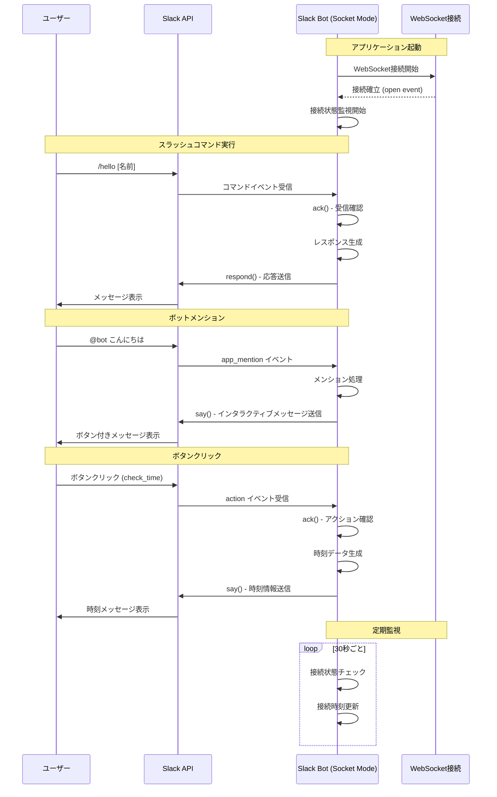
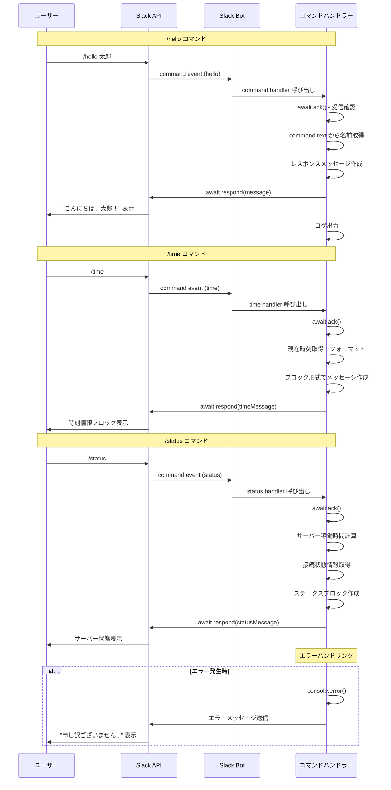
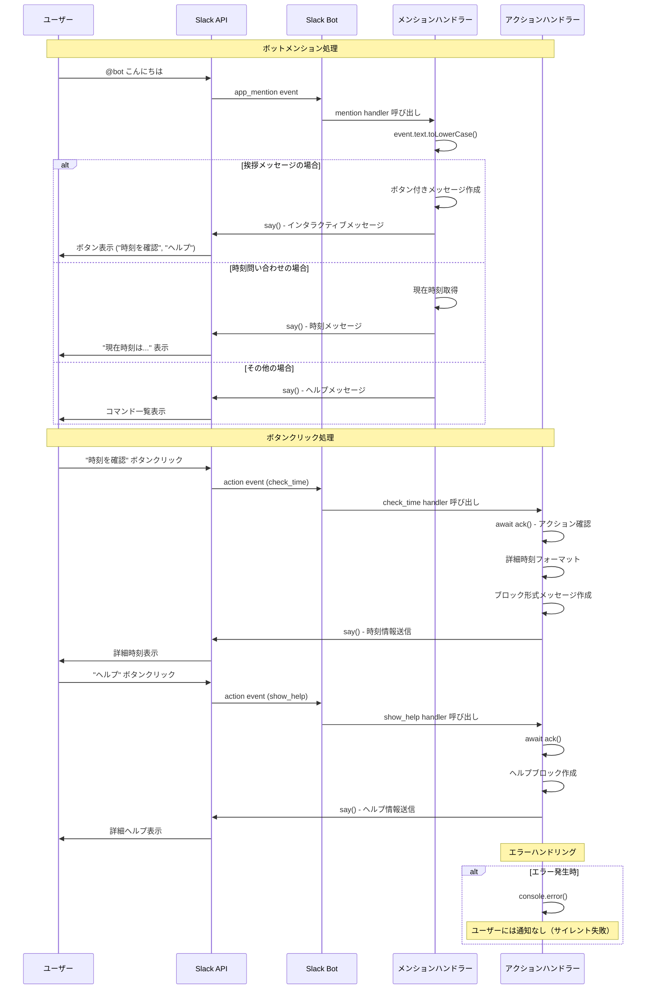
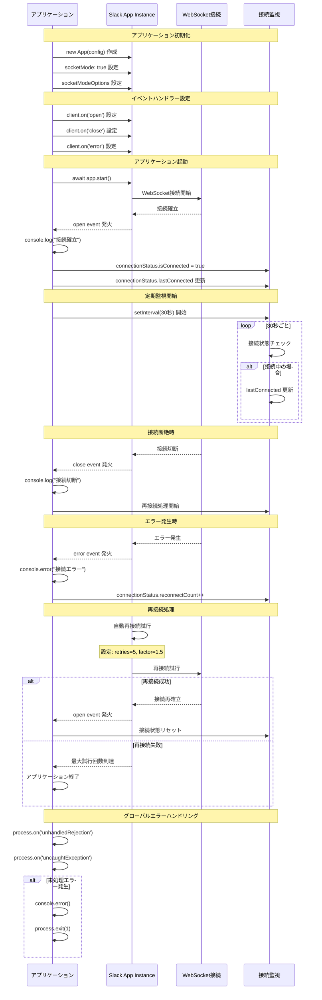

# Slack Bot システム シーケンス図

このドキュメントでは、api4slack Slack Botの主要な動作フローをMermaidシーケンス図で説明します。

## 1. システム全体の概要図

## 2. スラッシュコマンド詳細フロー

## 3. アプリメンション・ボタンインタラクション詳細フロー

## 4. WebSocket接続管理フロー

## 5. システム設計のポイント

### Socket Mode の利点
- HTTPSエンドポイント不要（ngrok、Reverse Proxy不要）
- ファイアウォール問題なし
- リアルタイムWebSocket通信
- 開発環境で直接テスト可能

### エラーハンドリング戦略
- 各ハンドラーでの try-catch
- WebSocket接続の自動再試行
- グローバルエラーハンドラー
- 詳細なログ出力

### 接続監視機能
- 30秒間隔での接続状態チェック
- 再接続回数の記録
- 稼働時間の追跡
- `/status` コマンドでの状態確認

これらのシーケンス図は、システムの理解と保守性向上、新機能追加時の参考資料として活用してください。