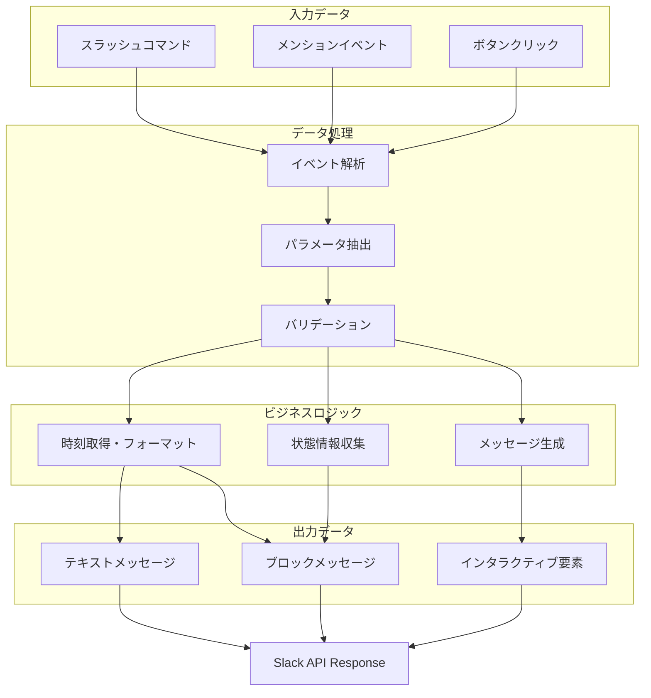
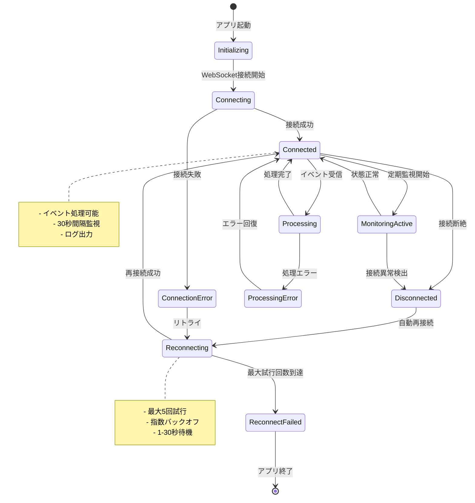
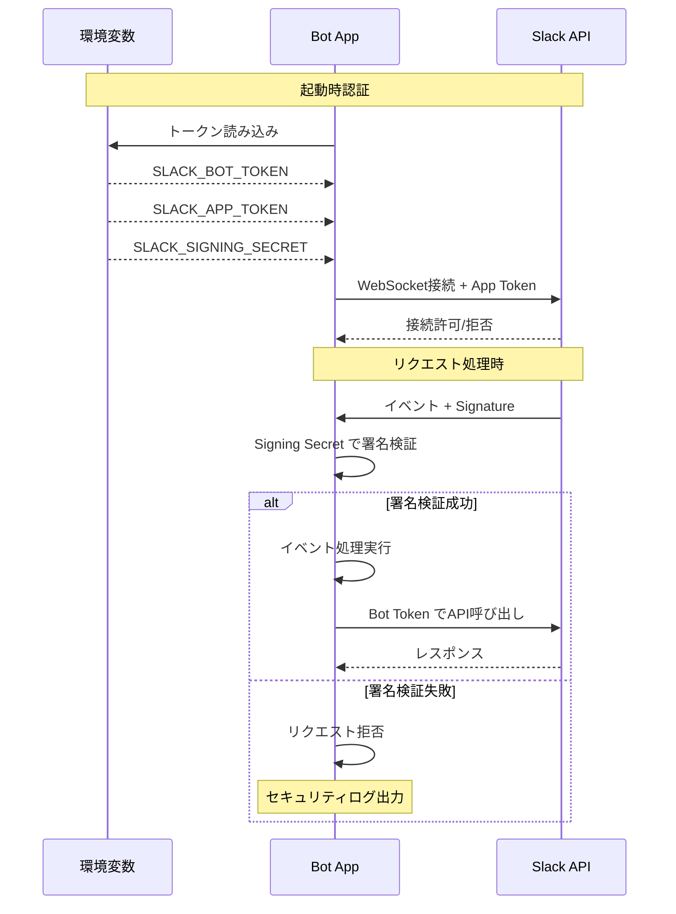

# システムアーキテクチャ図

この文書では、api4slack BotのシステムアーキテクチャをMermaid図で説明します。

## システム構成図

```mermaid
graph TB
    subgraph "Slack Workspace"
        User[👤 ユーザー]
        SlackAPI[Slack API Gateway]
    end
    
    subgraph "Bot Server (Node.js)"
        App[Slack Bolt App]
        
        subgraph "Event Handlers"
            SlashHandler[スラッシュコマンド<br/>ハンドラー]
            MentionHandler[メンション<br/>ハンドラー]
            ActionHandler[アクション<br/>ハンドラー]
        end
        
        subgraph "Core Components"
            WSClient[WebSocket Client]
            ConnMonitor[接続監視]
            ErrorHandler[エラーハンドラー]
        end
        
        subgraph "Business Logic"
            TimeService[時刻サービス]
            StatusService[状態サービス]
            MessageBuilder[メッセージ構築]
        end
    end
    
    subgraph "Configuration"
        EnvVars[環境変数<br/>(.env)]
        TokenManager[トークン管理]
    end

    %% User Interactions
    User -->|/hello, /time, /status| SlackAPI
    User -->|@bot mention| SlackAPI
    User -->|Button clicks| SlackAPI
    
    %% WebSocket Connection
    SlackAPI <-->|WebSocket<br/>(Socket Mode)| WSClient
    
    %% Internal Flow
    WSClient --> App
    App --> SlashHandler
    App --> MentionHandler
    App --> ActionHandler
    
    SlashHandler --> TimeService
    SlashHandler --> StatusService
    SlashHandler --> MessageBuilder
    
    MentionHandler --> MessageBuilder
    ActionHandler --> TimeService
    ActionHandler --> MessageBuilder
    
    %% Monitoring & Error Handling
    WSClient --> ConnMonitor
    WSClient --> ErrorHandler
    ConnMonitor --> StatusService
    
    %% Configuration
    EnvVars --> TokenManager
    TokenManager --> App
    
    %% Response Flow
    MessageBuilder --> App
    App --> WSClient
    WSClient --> SlackAPI
    SlackAPI --> User
    
    %% Styling
    classDef userClass fill:#e1f5fe,stroke:#0277bd,stroke-width:2px
    classDef slackClass fill:#fff3e0,stroke:#f57c00,stroke-width:2px
    classDef botClass fill:#f3e5f5,stroke:#7b1fa2,stroke-width:2px
    classDef serviceClass fill:#e8f5e8,stroke:#2e7d32,stroke-width:2px
    classDef configClass fill:#fce4ec,stroke:#c2185b,stroke-width:2px
    
    class User userClass
    class SlackAPI slackClass
    class App,WSClient,ConnMonitor,ErrorHandler botClass
    class SlashHandler,MentionHandler,ActionHandler,TimeService,StatusService,MessageBuilder serviceClass
    class EnvVars,TokenManager configClass
```

## データフロー図



## 接続・エラーハンドリング図



## セキュリティ・認証フロー



## 主要な設計原則

### 1. Socket Mode採用理由
- **HTTPSエンドポイント不要**: インフラ要件の簡素化
- **リアルタイム通信**: WebSocketによる双方向通信
- **開発効率**: ローカル開発環境で直接テスト可能
- **セキュリティ**: アウトバウンド接続のみ

### 2. エラーハンドリング戦略
- **段階的フォールバック**: 接続 → 再接続 → 終了
- **詳細ログ**: デバッグ情報とユーザー向けメッセージの分離
- **グレースフル degradation**: 部分的機能停止時の対応

### 3. 拡張性設計
- **ハンドラー分離**: 機能別の独立したハンドラー
- **サービス層**: ビジネスロジックの再利用可能化
- **設定外部化**: 環境変数による柔軟な設定管理

この設計により、保守性と拡張性を両立した堅牢なSlack Botシステムを実現しています。