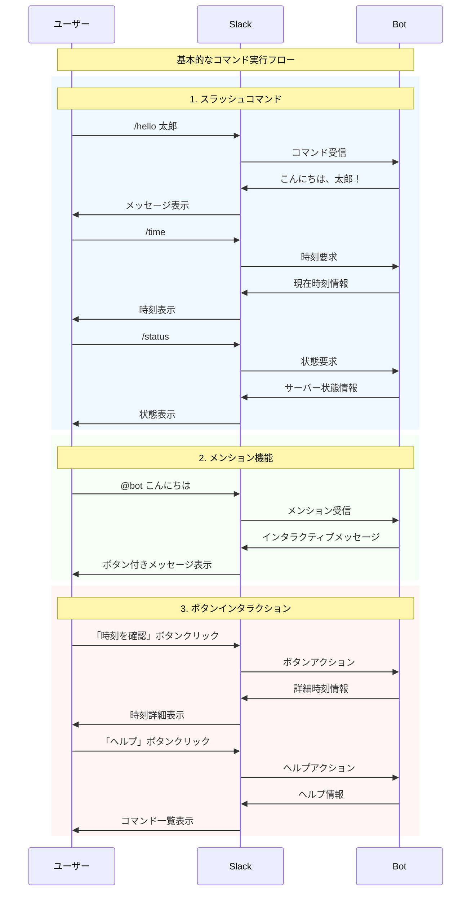

# ユーザーインタラクション フロー

この図は、ユーザーから見たSlack Botとの主要なインタラクションを示しています。

## メインユーザーフロー

## 利用可能な機能一覧

### スラッシュコマンド
| コマンド | 説明 | 使用例 |
|---------|------|--------|
| `/hello` | 挨拶メッセージ | `/hello` または `/hello 太郎` |
| `/time` | 現在時刻表示 | `/time` |
| `/status` | サーバー状態確認 | `/status` |

### メンション機能
- `@bot こんにちは` - インタラクティブな挨拶
- `@bot 時刻` - 簡易時刻表示
- `@bot [その他]` - ヘルプ情報表示

### ボタンアクション
- **時刻を確認** - 詳細な時刻情報を表示
- **ヘルプ** - 利用可能なコマンドと機能の説明

## 技術仕様

### 通信方式
- **WebSocket (Socket Mode)**: リアルタイム双方向通信
- **HTTPSエンドポイント不要**: ngrokやReverse Proxy不要
- **自動再接続**: 接続断絶時の自動復旧

### レスポンス形式
- **Block Kit**: Slackのリッチフォーマット使用
- **インタラクティブ要素**: ボタン、セクション等
- **マークダウン対応**: 絵文字、強調表示等

この設計により、ユーザーは直感的かつ効率的にBotと対話できます。